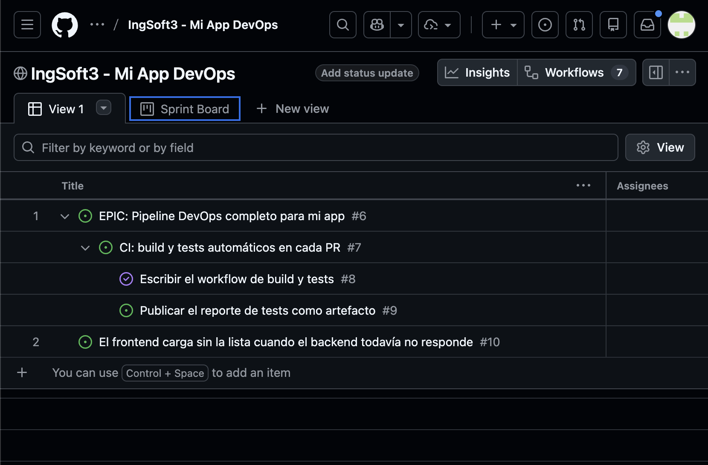
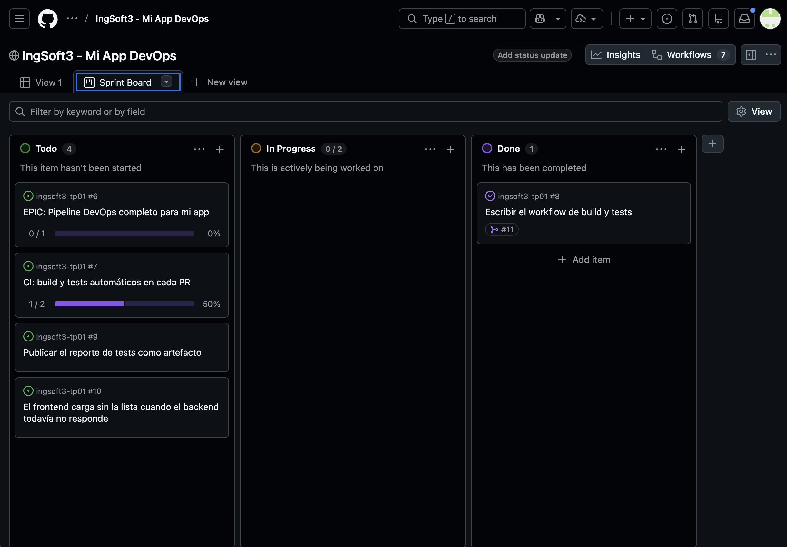

# Evidencias - TP1 Ingeniería de Software III

## 1. Protección de la rama main

Se intentó realizar un push directamente sobre la rama `main`.  
La operación fue rechazada debido a la regla de protección configurada.

---

## 2. Conflicto de merge detectado

Al intentar integrar la rama `feature/titulo-b`, GitHub detectó un conflicto con la rama `main`.

---

## 3. Resolución del conflicto

El conflicto se produjo porque ambas ramas modificaban la misma línea del archivo `README.md`.  
Se resolvió seleccionando la versión correspondiente a `feature/titulo-b`.

---

## 4. Merge completado

Luego de resolver el conflicto, el Pull Request pudo integrarse correctamente a la rama `main`.

---

## 5. Versión estable

Se creó el tag `v1.0.0` y se publicó la primera versión estable del TP mediante GitHub Releases.

## Evidencias del TP2 - Aplicacion de reservas

### Verificaciones realizadas

- El backend compilo correctamente con .NET 8.
- Las 4 pruebas automatizadas del backend finalizaron correctamente.
- Las 4 pruebas automatizadas del frontend finalizaron correctamente.
- ESLint no detecto errores.
- Vite genero correctamente la version de produccion.
- Se construyeron las imagenes del frontend y del backend.
- Docker Compose inicio correctamente el frontend, el backend y PostgreSQL.
- Se comprobo que los datos persisten al ejecutar `docker compose down`.
- Se comprobo que los datos se eliminan al ejecutar `docker compose down -v`.
- Las imagenes `v0.1.0` se publicaron en Docker Hub.
- El sistema se inicio correctamente descargando las imagenes publicadas.
- Se creo y consulto una reserva mediante la aplicacion levantada desde el registry.

### Aplicacion ejecutada desde Docker Hub

La siguiente captura demuestra que el frontend, el backend y PostgreSQL funcionan en conjunto utilizando las imagenes publicadas en Docker Hub:

### Imagenes publicadas

- `agussesin/reservas-frontend:v0.1.0`
- `agussesin/reservas-backend:v0.1.0`

## Evidencias del TP3 - Gestión del trabajo

Se organizó el trabajo en un [GitHub Project](https://github.com/users/agussesin/projects/1) mediante una épica, una historia, dos tareas y un bug independiente.

### Jerarquía del trabajo

La épica [#6](https://github.com/agussesin/ingsoft3-tp01/issues/6) contiene la historia [#7](https://github.com/agussesin/ingsoft3-tp01/issues/7), que se descompuso en las tareas [#8](https://github.com/agussesin/ingsoft3-tp01/issues/8) y [#9](https://github.com/agussesin/ingsoft3-tp01/issues/9). El bug [#10](https://github.com/agussesin/ingsoft3-tp01/issues/10) se gestionó de forma independiente.

### Sprint, límite WIP y trazabilidad

El Sprint Board utiliza las columnas Todo, In Progress y Done. La columna In Progress tiene un límite WIP de 2. La tarea #8 quedó vinculada con el Pull Request [#11](https://github.com/agussesin/ingsoft3-tp01/pull/11), se cerró automáticamente y pasó a Done.

## Evidencias del TP4

- [Reutilización del caché](evidencias/tp4-cache-reutilizado.png)
- [Gate bloqueado por fallo del backend](evidencias/tp4-gate-bloqueado.png)
- [Gate recuperado después de la corrección](evidencias/tp4-gate-recuperado.png)
- [Rama desactualizada bloqueada](evidencias/tp4-rama-desactualizada.png)
- [Rama actualizada y checks aprobados](evidencias/tp4-rama-actualizada.png)

